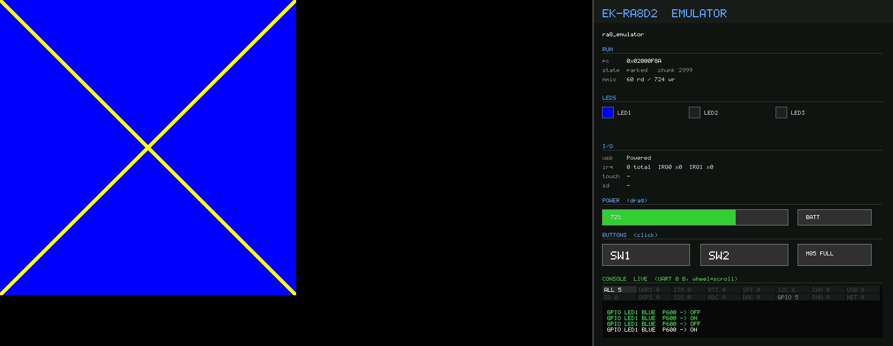
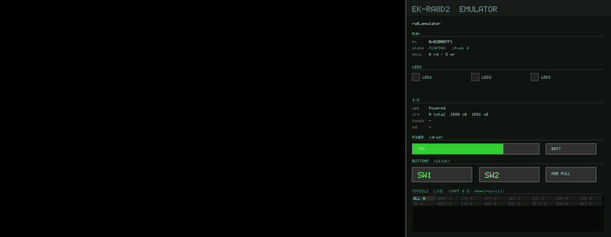

<!--
Copyright (c) 2026 Brighton Sikarskie
SPDX-License-Identifier: MIT
-->

# ra8_emulator

Boots the **real, unmodified firmware `.elf`** -- the same image that flashes to
an EK-RA8D2 -- on an emulated Cortex-M over a modelled RA8 peripheral space,
and shows it in a board view: the GLCDC panel framebuffer beside a status
sidebar carrying the LED indicators in their real colours and live USB, UART,
timer-IRQ and touch state. So a non-display app is observable graphically too,
and a display app shows its screen next to that state. Because it runs the
actual cross-compiled binary through the genuine bring-up path, what you see is
what the flashed firmware draws.

## Building

The build is Zig. There is no CMake in this repository any more: the emulator
is being rewritten from C to Zig (#14), and one build graph covers both trees
until that reaches parity.

```sh
zig build                       # both binaries into zig-out/bin
./zig-out/bin/ra8_emulator path/to/app.elf
```

`ra8_emulator` is the C emulator and is still the one that ships.
`ra8_emulator_zig` is the rewrite, and today it loads an image and runs until
the firmware touches peripheral space. `zig build test` runs the Zig unit tests
and the six C test binaries. Run either binary with no arguments and it prints
every option it takes.

### Installing the toolchain

Zig **0.14.1**, pinned to match `ARG ZIG_VERSION` in
`.devcontainer/Dockerfile` on the `zig/dev` branch of `bsikar/ra8-firmware`.
Nothing else is pinned by us: Zig ships its own clang, so the C tree no longer
needs a system compiler and the old "your `cc` is GCC 12" preflight is gone
with CMake.

Grab the release tarball, check it, and put it on `PATH`:

```sh
# linux x86_64; swap the triple for aarch64-linux, x86_64-macos or aarch64-macos
curl -fsSLO https://ziglang.org/download/0.14.1/zig-x86_64-linux-0.14.1.tar.xz
sha256sum zig-x86_64-linux-0.14.1.tar.xz
# 24aeeec8af16c381934a6cd7d95c807a8cb2cf7df9fa40d359aa884195c4716c
tar xf zig-x86_64-linux-0.14.1.tar.xz -C "$HOME/.local"
export PATH="$HOME/.local/zig-x86_64-linux-0.14.1:$PATH"
zig version   # 0.14.1
```

`brew install zig` and a distribution package both work too, as long as
`zig version` says 0.14.1. A different Zig is not supported: the build graph
uses 0.14 APIs and 0.15 renamed several of them.

### The two C libraries

Unicorn (the CPU) and Capstone (error-path disassembly) stay C libraries and
have to be on the machine:

```sh
sudo apt install libunicorn-dev libcapstone-dev      # Debian, Ubuntu
brew install capstone                                # macOS, plus a source
                                                     # build of the pinned Unicorn
```

Somewhere the loader does not look? Name the prefix, and the build adds its
`include/`, `lib/` and an rpath:

```sh
zig build -Ddeps-prefix="$HOME/.local/ra8-firmware/unicorn"
```

If a built binary starts but cannot find `libunicorn.so.2`, point
`LD_LIBRARY_PATH` at it (`DYLD_LIBRARY_PATH` on macOS).

The live window is a macOS Cocoa window. Every other path, headless boot, the
MMIO report, frame capture and console capture, builds and runs headless on
Linux too, which is what lets the emulator gates run on a Linux CI runner.

## Unicorn is version-pinned, deliberately

The CPU is Unicorn, QEMU's core as a library. Its decode of Armv8.1-M
(Helium/MVE) **differs between releases**, so an unpinned emulator makes the
same commit pass on one box and fault on another
(bsikar/ra8-firmware#354). The pin lives in `docs/TOOLCHAIN.md` in the firmware
repository, and the emulator gates there fail loudly when the runtime library is
not it. That is not caution: an earlier
mismatch had one machine raising a spurious coprocessor fault on the Helium
store family, which is exactly why the same commit faulted locally and passed
in CI.

Unicorn itself tops out at Cortex-M33 (Armv8-M), yet the M85 firmware executes
on it, because the boot path emits no v8.1-M-only opcode. An
invalid-instruction trap reports any that ever appears.

## Which part it emulates

The RA8P1 shares the RA8D2's entire register map and memory map -- the
peripheral bases are byte-identical -- so one set of peripheral models serves
both parts and an RA8P1-linked ELF boots exactly as an RA8D2 one does. The
RA8P1 is "RA8D2 plus an Arm Ethos-U55 NPU", and selecting it exposes that one
extra register window.

The NPU is modelled **honestly but not implemented**: the window is mapped so
NPU-touching firmware does not spin on a phantom ready bit, every read returns a
stable zero -- no fabricated identity register, no faked done bit, an inference
is never pretended -- writes are recorded, and the end-of-run report prints a
`MAPPED BUT UNMODELLED` line with the access tally whenever it was touched.
bsikar/ra8-firmware#222 delivered this honest RA8P1 profile and mapped stub; a
real command-stream model remains under the fidelity epic, #1 here. On the
RA8D2 profile the block is gated off entirely, so that run is
byte-for-behaviour unchanged.

## How it works

**Memory map.** Code, vectors and the debug space are Unicorn-owned guest
pages; the Renesas peripheral space is callback MMIO. SRAM, SDRAM and OSPI live
in host-owned apertures, and every engine maps **both** the Secure window and
its IDAU bit[28] Non-secure alias onto those same pages. Secure/Non-secure and
CPU0/CPU1 coherence are therefore *structural*: a guest store stays on the
translator's fast path, with no write hook, mirror step or dirty-page index in
the store path. The legacy data-flash window is deliberately left unmapped,
because the silicon does not decode it either.

The apertures are anonymous host mappings, never pre-touched, so a large
logical guest memory costs resident host memory only for the pages the firmware
actually writes -- asserted in both directions with `mincore`. Closing a
workspace refuses while an engine is still bound to it, because a bound engine
holds references into the pages the close would release.

**Peripherals.** A sparse fallback covers most of the boot path: control writes
read back as written, so "configure then verify" works, and once the firmware
spins reading one address past a threshold, reads alternate all-zeros and
all-ones so a single-bit poll for either edge completes instead of hanging.
That one generic rule satisfies almost every stabilization poll there is.

Above it sit register-accurate blocks -- GPIO, the timers, the SCI_B UART, and
I2C with the touch controller on it -- each in its own file, superseding the
fallback for its own address range. The UART model captures each transmit-data
write to the console sink, serves a host receive queue, and raises the transmit
and receive interrupts through the emulated interrupt path, so interrupt-driven
serial works as well as polled.

Exactly one register needs bespoke behaviour: the clock-frequency latches strip
a write key byte on readback, which matters because the firmware polls them for
an exact value rather than an edge.

**Time.** Between emulation chunks the installed SysTick handler is
cooperatively invoked as a function, so the tick counter advances and
millisecond delays return.

**USB.** The Full-Speed device controller is modelled register by register, and
a virtual host runs the standard chapter-9 enumeration against the *real*
vendored USB device stack -- raising the controller interrupt through the same
path the silicon would, so the genuine ISR answers each SETUP. For host-mode
firmware the High-Speed host controller is unmodelled, so the emulator instead
seams the first-party host primitives to a virtual keyboard or a virtual
mass-storage disk, and the firmware's real host stack enumerates, mounts and
browses it.

## Adding a peripheral block

The model is **decentralized**: the core owns only the block registry, MMIO
dispatch and interrupt routing, and keeps no hand-maintained list of blocks. So
blocks can be added in parallel without touching the core. Two steps:

1. Add a `board_periph_<blk>.c`. Implement the block's read and write handlers,
   plus optional tick, reset and report hooks; describe it with a static
   descriptor giving its absolute register base, span and ordering; and
   self-register it from a file-scope constructor. The emulator is a host
   program, so the constructor runs before `main` and the block is registered
   by the time the core resets it.
2. Nothing else. `build.zig` discovers every `src/periph/board_periph_*.c`
   at configure time, so there is no source list to edit and no conflict
   between blocks added in parallel.

MMIO is dispatched by disjoint address range, so registration order is
irrelevant, and the optional hooks run in ascending descriptor order, so two
blocks added in parallel cannot conflict. A block needing a board-view value
declares its getter in the core header and implements it in its own file.

## Capturing the board view

The Cocoa window is macOS only. Everywhere else `board_view_stub.c` is compiled
and `--view` falls back to headless, so the portable way to see what a run drew
is the frame-dump path, which needs no display server at all:

```sh
# final composite (panel + status sidebar) as a single still
./zig-out/bin/ra8_emulator app.elf --ppm run.ppm

# ~20 fps of composites for the first 3 emulated seconds
./zig-out/bin/ra8_emulator app.elf --record frames/ --record-secs 3
```

`--record` writes `frames/frame_NNNNNN.ppm`. `--size WxH` or `--panel <file>`
sizes the panel (1024x600 by default) and `--rotate 90|180|270` turns it.
Convert with anything that reads PPM, for example
`magick run.ppm run.png` for a still or
`ffmpeg -framerate 20 -i frames/frame_%06d.ppm out.gif` for the animation.

### What a run actually looks like

Both captures below came out of that path, from a real firmware image: the
`lcd_draw_x` example built from `bsikar/ra8-firmware` `main` with the pinned
Arm GNU toolchain 13.3, then booted here with no board attached.



The composite is one pixel buffer: the emulated LCD panel on the left, the
status sidebar on the right (run state and PC, the three LEDs, I/O, the power
and button widgets, and the live console). That is why an overlay assertion is
a pixel check -- the sidebar is in the frame, not in a separate window.



The animation is the same run recorded over three emulated seconds, showing
LED1 driven from P600 and the console filling as the firmware runs.

Reproduce both:

```sh
./zig-out/bin/ra8_emulator lcd_draw_x.elf --ppm run.ppm --record frames/ --record-secs 3
```

## What it is for, and what it is not

It fakes hardware *handshakes*. It validates "does the firmware drive the
controller correctly", not silicon timing, and it complements the bench rather
than replacing it. `scripts/emu/smoke.sh` gates a subset in CI, and the board
view is verifiable headlessly because the sidebar is composited into the same
pixel buffer the window shows -- a frame capture carries the panel *and* the
sidebar, so an overlay assertion is a pixel check rather than a human looking.

Running the real binary for longer than a bench run does is how it earns its
keep. It found a module-stop reference leak that only faults after the counter
saturates, which no short HIL run ever reaches (bsikar/ra8-firmware#68); and
tracing the USB
device worker showed two demos silently stalling because their USB memory pool
was too small to satisfy a class's cache-safe buffer, so the device never
asserted its pull-up and the failure looked like a link problem.
